### After redefine
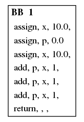

### After redefine jump
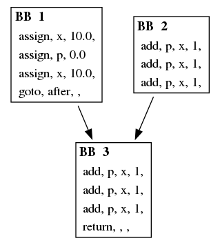

### Diamond
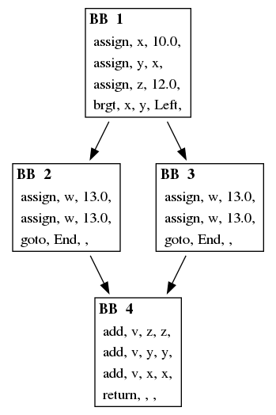
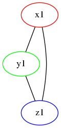
### Partial overlap
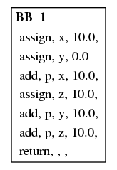
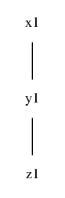
### Jump fallthrough
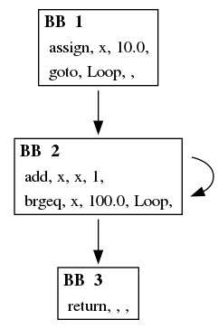
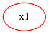
### Loop extra liveness
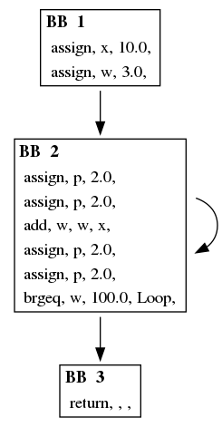
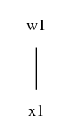
### non overlapping ranges
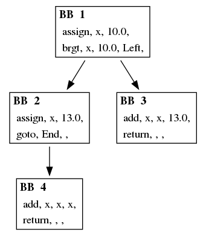
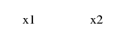
### only branch usage
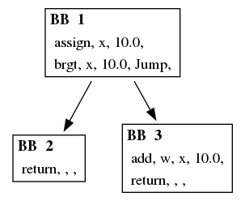

### only fallthrough usage
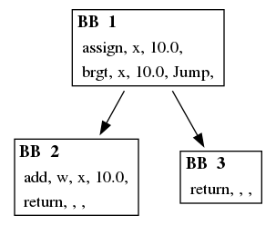
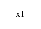
### Spill least defined first
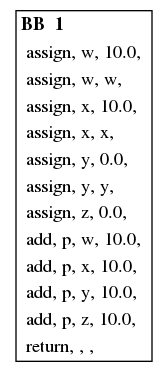
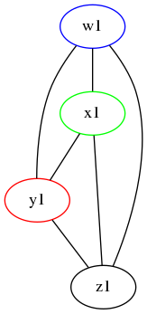
### Spill least used first
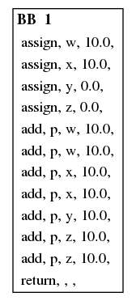
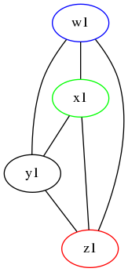
### Spill first on tie
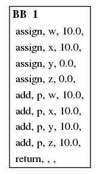
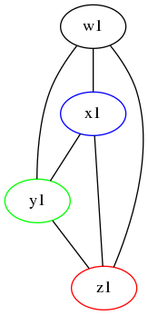
### Three color (sanity check)
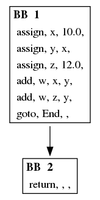

### unreachable uses
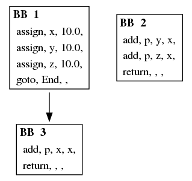

